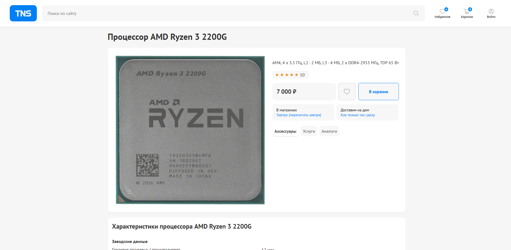
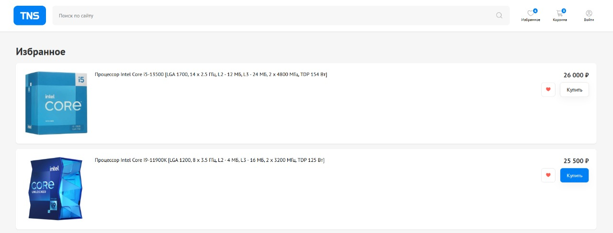
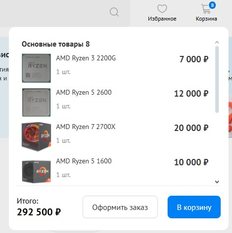
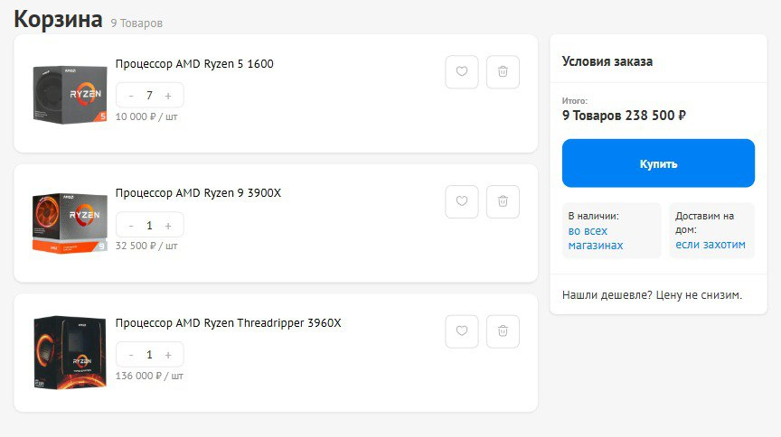

# Typescript Networked Store

Интернет-магазин центральных процессоров (некоммерческое веб-приложение)

## Стек :

- React
- Typescript
- Redux Toolkit
- Supabase
- Swiper.js React
- React Router
- React-hook-form
- CRA, node.js v.10.8.0

## Страницы сайта :

### Главная страница

Содержимое главной страницы

<h2 style="color: #0080f5;">Блок "Вы недавно смотрели"</h2>

### Каталог / Поиск

Содержимое таблицы товаров

### Страница товара

### Страница "Избранные"

Количество избранных товаров всегда актуально и отображается на кнопке в хедере, реализовано через localStorage + redux

### Страница "Корзина"

При наведении на кнопку корзины в хедере, показывается popup с содержимым,
также на кнопке отображается число экземпляров

Содержимое страницы корзины

Учитываются как экземпляры, так и единицы.
В левой части карточки товаров, можно менять количество конкретного товара, это отобразится в калькуляторе справа:
7шт процессора1, 1шт процессора2, 1шт процессора3 - итого 9 товаров на сумму 238 500 рублей.

### Страница "Авторизация"

При наведении на кнопку "профиля" в хедере показывается popup

## Описание :

##### Компоненты функциональные.

##### Авторизация на Supabase и стейт-менеджер Redux привязаны в основном к Header-компоненту.

##### Слайдеры на сайте: Swiper.js.

##### Ссылки ведущие на страницы "не про программирование" ведут на мокап-страницу.

## Деплой

[crede322.github.io/TNS/](https://crede322.github.io/TNS/)

## License

This project is licensed under the MIT License - see the [LICENSE](./LICENSE) file for details.
