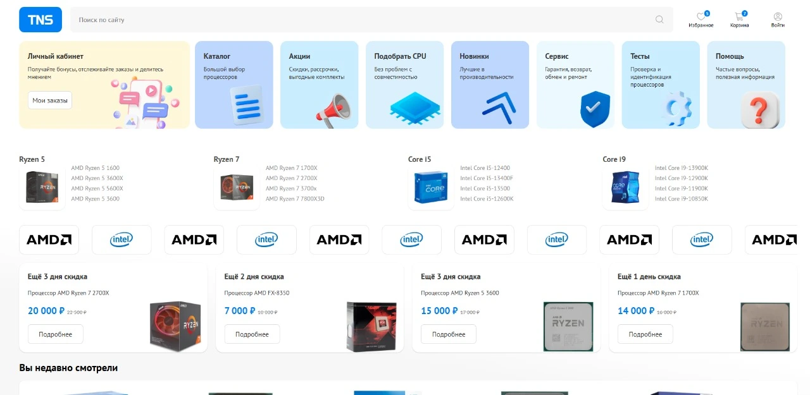
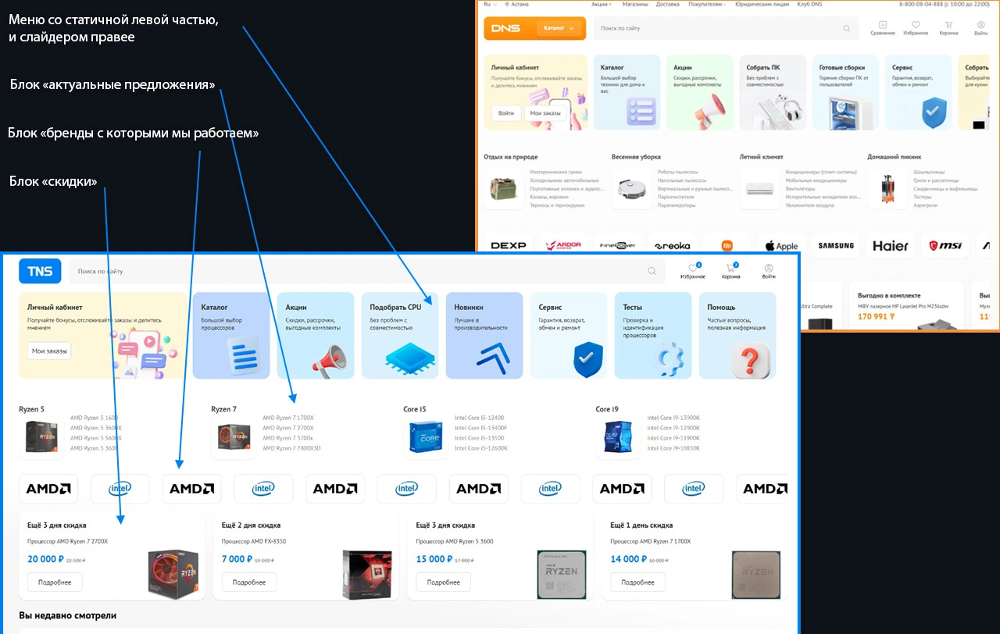
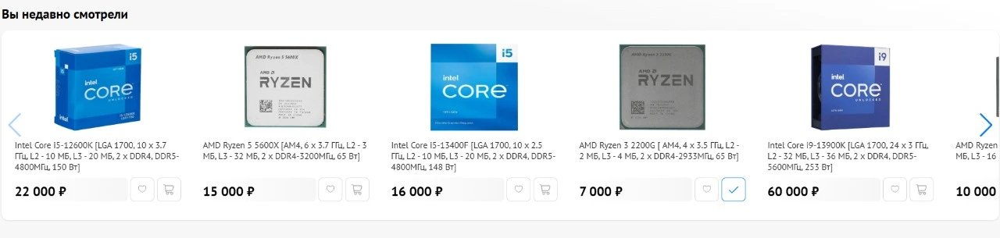
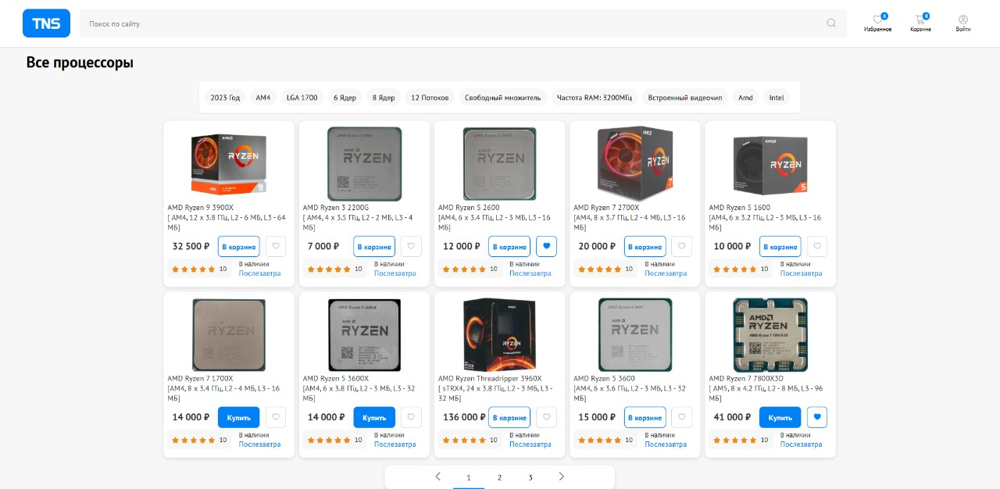
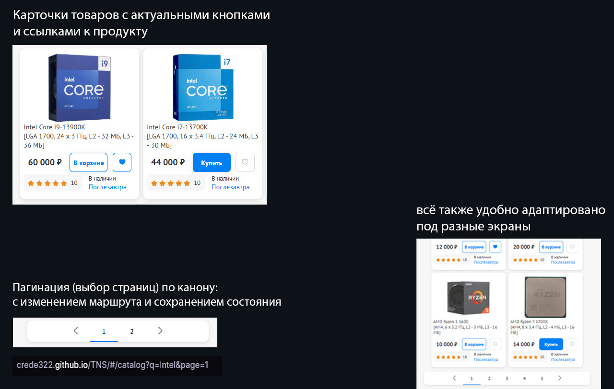

# Typescript Networked Store

Интернет-магазин центральных процессоров (некоммерческое веб-приложение)

## Стек :

- React
- Typescript
- Redux Toolkit
- Supabase
- Swiper.js React
- React Router
- React-hook-form
- CRA, node.js v.10.8.0

## Страницы сайта :

### Главная страница

Содержимое главной страницы

<h2 style="color: #0080f5;">Блок "Вы недавно смотрели"</h2>

### Каталог

#### Страница товара

#### Страница поиска

#### Избранные

#### Корзина

#### Мокап-страница

## Описание :

##### Компоненты функциональные.

##### Авторизация на Supabase и стейт-менеджер Redux привязаны в основном к Header-компоненту.

##### Слайдеры на сайте: Swiper.js.

##### Ссылки ведущие на страницы "не про программирование" ведут на мокап-страницу.

## Деплой

[crede322.github.io/TNS/](https://crede322.github.io/TNS/)

## License

This project is licensed under the MIT License - see the [LICENSE](./LICENSE) file for details.
